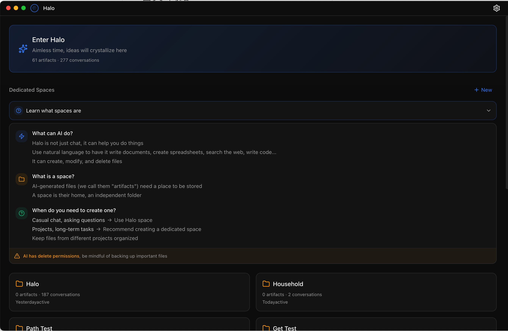
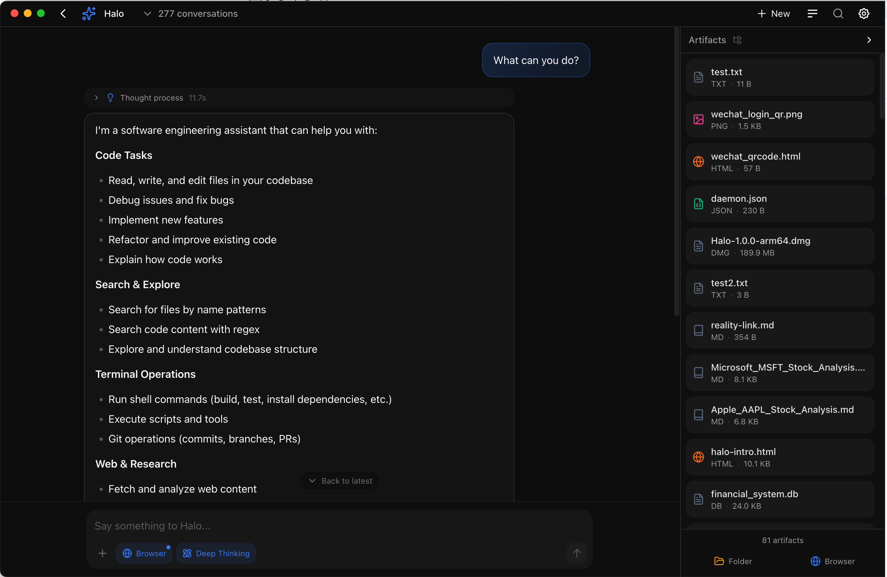
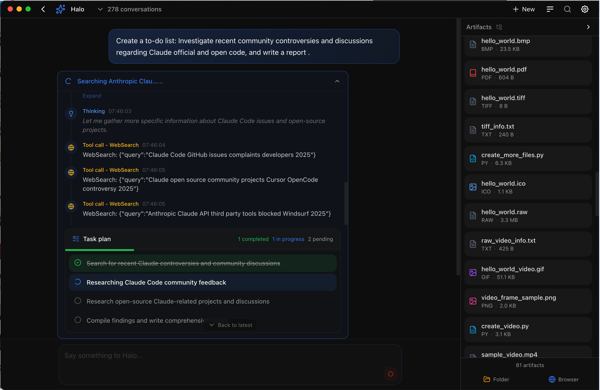
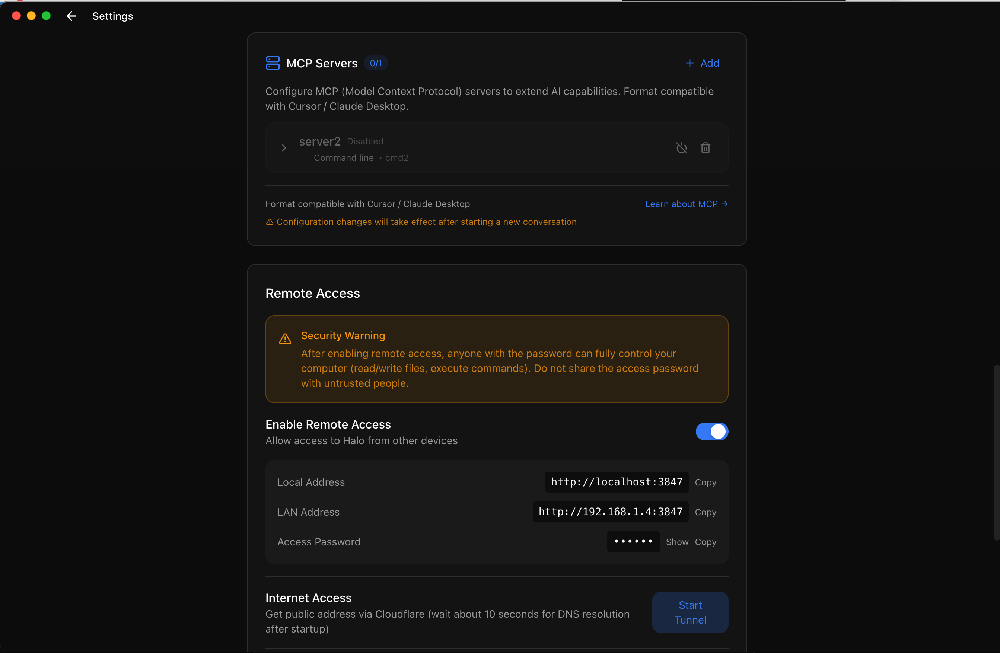
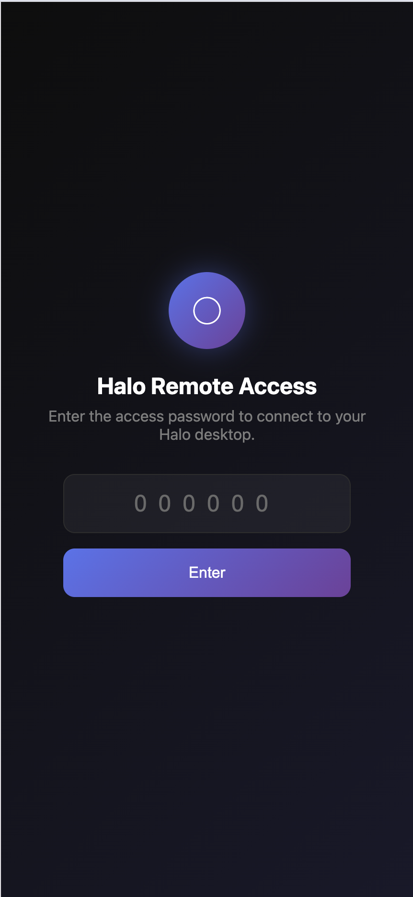
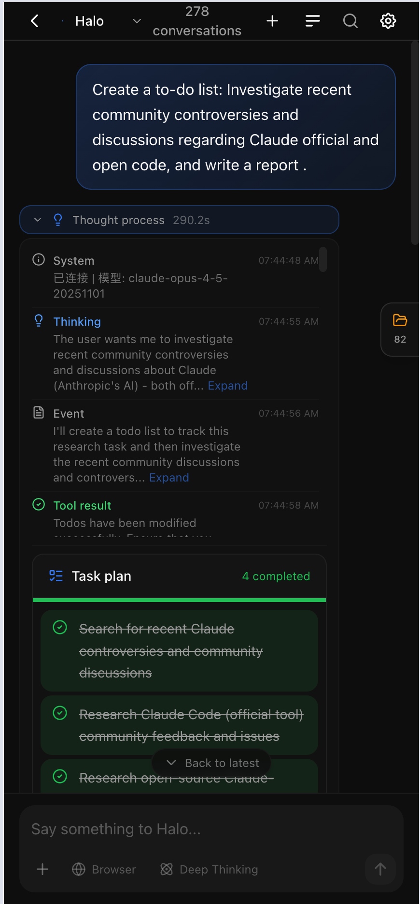

<div align="center">


# Halo

### AI That Gets Things Done

The first open-source desktop client that brings **Claude Code's Agent capabilities** to everyone.

[](https://github.com/openkursar/hello-halo/stargazers)
[](LICENSE)
[](#installation)
[](https://github.com/openkursar/hello-halo/releases)

[Download](#installation) · [Documentation](#documentation) · [Contributing](#contributing)

**[中文](./README.zh-CN.md)** | **[Español](./README.es.md)**

</div>

---

<div align="center">



</div>

---

## The Problem

**Claude Code CLI is powerful, but...**

- It lives in the terminal — intimidating for non-developers
- No visual feedback for file operations
- Hard to track what AI created or modified
- Complex setup for most users

**Halo solves this** by wrapping Claude Code's full Agent capabilities in a beautiful, intuitive desktop experience.

> Think of it like this:
> **Windows** turned DOS into desktops and folders.
> **Halo** turns Claude Code CLI into a visual AI companion.

---

## Features

<table>
<tr>
<td width="50%">

### 🤖 Real Agent Loop
Not just chat. Halo can **actually do things** — write code, create files, run commands, and iterate until the task is done.

### 🪐 Space System
Isolated workspaces keep your projects organized. Each Space has its own files, conversations, and context.

### 🎨 Beautiful Artifact Rail
See every file AI creates in real-time. Preview code, HTML, images — all without leaving the app.

</td>
<td width="50%">

### 📱 Remote Access
Control your desktop Halo from your phone or any browser. Perfect for on-the-go AI assistance.

### 🌐 AI Browser
Let AI control a real embedded browser. Web scraping, form filling, testing — all automated.

### 🔌 MCP Support
Extend capabilities with Model Context Protocol. Compatible with Claude Desktop MCP servers.

</td>
</tr>
</table>

### More Features

- **Multi-provider Support** — Anthropic, OpenAI, DeepSeek, and any OpenAI-compatible API
- **Real-time Thinking** — Watch AI's thought process as it works
- **Tool Permissions** — Approve or auto-allow file/command operations
- **Dark/Light Themes** — System-aware theming
- **i18n Ready** — English, Chinese, Spanish (more coming)
- **Auto Updates** — Stay current with one-click updates

---

## Installation

### Download

| Platform | Download | Requirements |
|----------|----------|--------------|
| **macOS** (Apple Silicon) | [Download .dmg](https://github.com/openkursar/hello-halo/releases/latest) | macOS 11+ |
| **macOS** (Intel) | Coming soon | macOS 11+ |
| **Windows** | [Download .exe](https://github.com/openkursar/hello-halo/releases/latest) | Windows 10+ |
| **Linux** | [Download .AppImage](https://github.com/openkursar/hello-halo/releases/latest) | Ubuntu 20.04+ |

### Build from Source

```bash
# Clone the repository
git clone https://github.com/openkursar/hello-halo.git
cd hello-halo

# Install dependencies
npm install

# Run in development mode
npm run dev

# Build for production
npm run build:mac    # macOS
npm run build:win    # Windows
npm run build:linux  # Linux
```

---

## Quick Start

1. **Launch Halo** and enter your API key (Anthropic, OpenAI, or compatible)
2. **Start chatting** — try "Create a simple todo app"
3. **Watch the magic** — see files appear in the Artifact Rail
4. **Preview & iterate** — click any file to preview, ask for changes

### Screenshots







<p align="center">
  
  &nbsp;&nbsp;
  
</p>

*Remote Access: Control Halo from your phone*

---

## How It Works

```
┌─────────────────────────────────────────────────────────────────┐
│                          Halo Desktop                            │
│  ┌─────────────┐    ┌─────────────┐    ┌───────────────────┐   │
│  │   React UI  │◄──►│    Main     │◄──►│  Claude Code SDK  │   │
│  │  (Renderer) │IPC │   Process   │    │   (Agent Loop)    │   │
│  └─────────────┘    └─────────────┘    └───────────────────┘   │
│                            │                                     │
│                            ▼                                     │
│                    ┌───────────────┐                            │
│                    │  Local Files  │                            │
│                    │  ~/.halo/     │                            │
│                    └───────────────┘                            │
└─────────────────────────────────────────────────────────────────┘
```

- **100% Local** — Your data never leaves your machine (except API calls)
- **No Backend Required** — Pure desktop client, use your own API keys
- **Agent Loop** — Real tool execution, not just text generation

---

## Tech Stack

| Layer | Technology |
|-------|------------|
| Framework | Electron + electron-vite |
| Frontend | React 18 + TypeScript |
| Styling | Tailwind CSS + shadcn/ui patterns |
| State | Zustand |
| Agent Core | @anthropic-ai/claude-code SDK |
| Markdown | react-markdown + highlight.js |

---

## Roadmap

- [x] Core Agent Loop with Claude Code SDK
- [x] Space & Conversation management
- [x] Artifact preview (Code, HTML, Images, Markdown)
- [x] Remote Access (browser control)
- [x] AI Browser (CDP-based)
- [x] MCP Server support
- [ ] Plugin system
- [ ] Voice input
- [ ] Mobile app (React Native)
- [ ] Team collaboration

---

## Contributing

We welcome contributions! See [CONTRIBUTING.md](CONTRIBUTING.md) for guidelines.

```bash
# Development setup
git clone https://github.com/openkursar/hello-halo.git
cd hello-halo
npm install
npm run dev
```

**Areas we need help:**
- 🌍 Translations (see `src/renderer/i18n/`)
- 🐛 Bug reports and fixes
- 📖 Documentation improvements
- 💡 Feature suggestions

---

## Community

- [GitHub Discussions](https://github.com/openkursar/hello-halo/discussions) — Questions & ideas
- [Twitter/X](https://twitter.com/anthropics) — Updates & announcements

---

## License

MIT License — see [LICENSE](LICENSE) for details.

---

<div align="center">

**If Halo helps you, consider giving it a ⭐**

[⬆ Back to Top](#halo)

</div>
