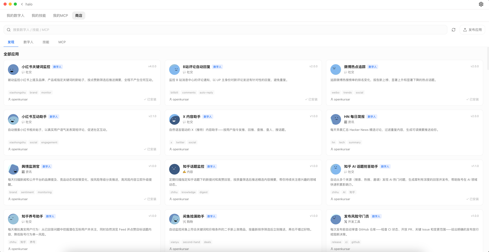
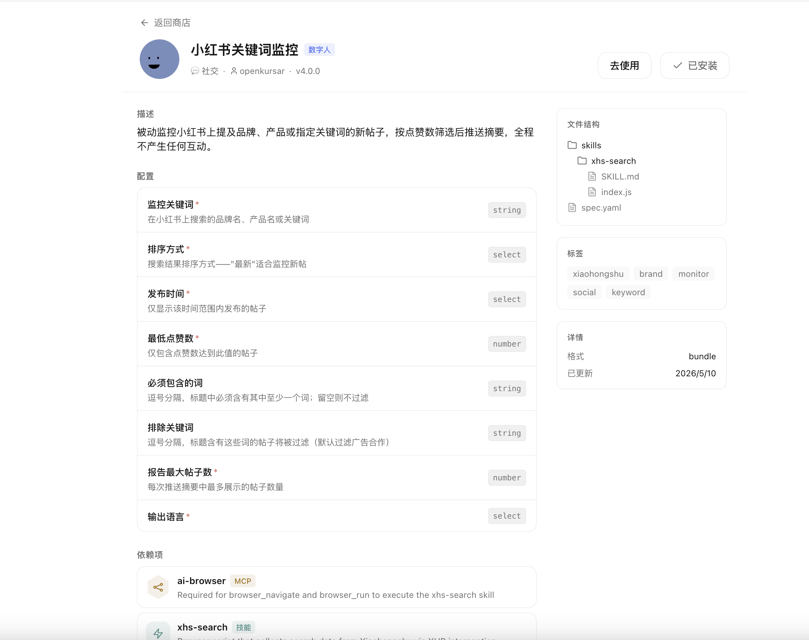
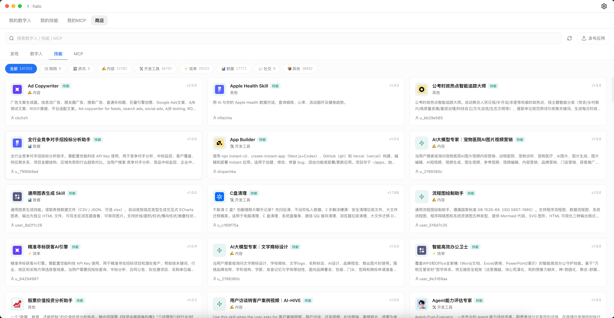

<div align="center">


# Halo

### 你的 AI 工作站 — 面向團隊與個人

本地部署，7x24 小時自動化。AI 數位人替你幹活，你只需做決策。

[](https://github.com/openkursar/hello-halo/stargazers)
[](../LICENSE)
[](#安裝)
[](https://github.com/openkursar/hello-halo/releases)

[**下載**](#安裝) · [**文件**](#文件) · [**參與貢獻**](#參與貢獻)

**[English](../README.md)** | **[简体中文](./README.zh-CN.md)** | **繁體中文** | **[Español](./README.es.md)** | **[Deutsch](./README.de.md)** | **[Français](./README.fr.md)** | **[日本語](./README.ja.md)**

</div>

<!-- TODO: 替換為 30 秒 GIF：使用者輸入一句話 -> Agent 自動寫程式碼 -> 檔案出現在 Artifact Rail -> 預覽結果 -->
<div align="center">



</div>

---

## 為什麼選擇 Halo？

Halo 是一個基於前沿 Agent 能力建構的 AI 工作站，採用可插拔引擎架構，支援 [Claude Code](https://github.com/anthropics/claude-code)、[Codex](https://github.com/openai/codex) 等。產品層累計超過 30 萬行程式碼，經過數萬使用者驗證，在企業環境中穩定運行。Halo 提供：

| Halo 的核心能力 |
|:---:|
| **你的日常 AI 夥伴** — 寫程式碼、做產品、搞營運、寫文案、做調研，日常工作的全能搭檔 |
| **100% 本地運行，零雲端依賴** — 資料不出本機，滿足企業合規稽核要求 |
| **AI 數位人** — 7x24 自主運行的 AI 員工，處理監控、報表、日常操作 |
| **AI 瀏覽器** — 內嵌瀏覽器由 AI 直接控制，可自動化任何 Web 系統 |
| **知識庫** — 丟進常用檔案，AI 回答問題、幹活時自動參考 |
| **AI 終端機** — 內建終端機，AI 能直接操作，SSH、堡壘機、驅動任意 CLI 工具 |
| **AI 操作 Halo 本身** — 自然語言操作數百項功能，按需載入不佔用上下文 |
| **企業微信 / 微信原生控制** — 在企業 IM 中管理 AI Agent，零培訓成本 |
| **遠端存取** — 手機 / H5 / 微信 / Android 隨時控制，管理者行動端審閱進度 |
| **下載即用** — 零設定、無需後端，IT 幾分鐘完成部署 |

> 100% 相容 Claude Code 的 Agent 能力、MCP 和 Skills。

---

## AI 數位人 — 你的自主 AI 勞動力

給它一個目標和執行頻率，AI 數位人就會像員工一樣自主推進——不是執行固定腳本的機器人，而是有記憶、能判斷、會操作的數位員工。

**有手有腳：** 數位人和對話模式共享完全相同的 Agent 能力——AI 瀏覽器操作網頁、AI 終端機操作系統和 CLI 工具、企業微信/微信收發訊息，甚至能操作 Halo 自己調整設定。不是只會點瀏覽器的單一工具人。

**長期記憶：** 每次運行不是從零開始，數位人記得上次處理到哪、遇到過什麼、判斷出過什麼結論——持續累積，而不是重複勞動。

### 自主運行的 Agent，7x24 不停歇

建立一個 AI 數位人，給它一個任務和執行頻率，它就會按計畫自主運行。不用盯螢幕，不用維護腳本。

**社群與內容平台自動化：**

- 自動回覆小紅書、B站、知乎的評論和私訊
- 定時在 Twitter / X、微信公眾號發布內容
- 監控品牌提及和競品動態，生成每日摘要
- 追蹤熱門話題，自動起草內容建議

**企業內部自動化：**

- 巡檢內部 OA / CRM / ERP 系統，標記逾期工單和異常
- 從 Jira / GitLab / GitHub 活動中生成每日站會報告
- 監控 CI/CD 流水線，建構失敗時通知並自動建立事故工單
- 定期執行內部儀表板合規檢查
- 跨部門採集資料，彙總週報

從 **AI 數位人商店** 一鍵安裝，為企業部署**私有商店**，或用自然語言自行建立。

> 把它想成 cron + RPA + AI Agent 的合體——只不過你用自然語言描述需求就行。

**微信 / 企業微信就是你的控制面板。** AI 數位人支援透過個人微信 / 企業微信進行雙向對話控制——不只是接收通知，你可以直接在企業 IM 中給數位人下指令、查進度、要報告。


*實際效果 — 數位人 7x24 操作知乎、B站、小紅書與 X（商店有現成 Browser Action）：*

[](https://www.bilibili.com/video/BV1yfNuzaEtv/) &nbsp; [](https://www.bilibili.com/video/BV1yfNuzaEtv/)

### Halo Browser Action — AI 決策，腳本執行

傳統 RPA 按固定腳本執行，遇到變化就崩；Halo 反過來：**AI 負責判斷決策，Browser Action 負責精準執行。**

Browser Action 是一種特殊的 Skill：針對某個平台的一個具體操作，預先寫好的可複用 `.js` 腳本。AI 只負責判斷*做什麼、什麼時候做*，腳本負責*怎麼做*——這是 Halo 和那些「到處亂點」的 AI 瀏覽器 Agent 的根本區別。

腳本直接在真實瀏覽器中運行，能存取頁面 DOM、Cookie 和內部 API，公開網站和企業內網系統都適用。

已有現成 Browser Action 覆蓋小紅書、B站、知乎、Twitter / X、微信等平台，企業團隊可以為內部系統編寫私有 Action，社群也可以貢獻和分享。**AI 決策，Action 執行。穩定、可複用、可稽核。**

想自己打造一個？完整教學——打造一個定時巡檢登入態內部系統的 **OA 審批助手**——詳見文件：[**打造 Browser Action 數位人 →**](https://hello-halo.cc/docs/digital-humans/guide-02-build.html)

### 遠端存取 — 隨時隨地管理你的 AI 團隊

開啟遠端存取後，手機 / H5 / 微信 / Android 客戶端都能控制桌面上的 Halo。開會時、通勤中、在路上——隨時查看數位人產出、審批決策、下達新指令，無需坐在工位上。

---

## 知識庫

把常用辦公檔案丟進去，AI 回答問題、幹活時會自動參考。

支援 PDF、PPT、Markdown 等常見辦公檔案，還支援圖片 OCR 辨識。新建知識庫、綁定到某個空間後，直接問 AI「我的知識庫裡有什麼」就能用。

---

## AI 終端機

Halo 內建終端機，AI 能直接操作它——SSH、堡壘機、ping+token 登入，或者驅動 Claude Code / Codex 等任意原生 CLI 工具。

終端機持久存在、可視化：用完了自己關掉，或者隨時點開人工接管，人機交替操作互不衝突。

---

## AI 操作 Halo 本身

設定、對話管理、企業微信 Bot 設定等數百項操作，直接用自然語言讓 AI 幫你做，不用翻選單。

這些操作預設不佔用上下文——問到哪個功能才按需載入，幾百項能力也不會拖慢對話。

---

## 快速開始

**30 秒上手：**

1. [下載安裝](#安裝)，啟動 Halo
2. 輸入你的 API Key（推薦 Anthropic）
3. 開始對話——試試 `用 React 做一個待辦應用` 或 `幫我分析這個專案的程式碼結構`
4. 在 Artifact Rail 中看到檔案出現，點擊預覽，提出修改意見

> 推薦模型：Claude Sonnet / Opus 系列

---

## 安裝

### 下載安裝（推薦）

| 平台 | 下載 | 系統要求 |
|------|------|----------|
| **macOS** (Apple Silicon) | [.dmg](https://github.com/openkursar/hello-halo/releases/latest) | macOS 11+ |
| **macOS** (Intel) | [.dmg](https://github.com/openkursar/hello-halo/releases/latest) | macOS 11+ |
| **Windows** | [.exe](https://github.com/openkursar/hello-halo/releases/latest) | Windows 10+ |
| **Linux** | [.AppImage](https://github.com/openkursar/hello-halo/releases/latest) | Ubuntu 20.04+ |
| **Android** | [.apk](https://github.com/openkursar/hello-halo/releases/latest) | Android 8+ |
| **iOS** | 從原始碼建構 | iOS 15+ |

**下載、安裝、運行。** 無需 Node.js、npm 或終端機。IT 可以零伺服端依賴地在全組織分發。

### 從原始碼建構

```bash
git clone https://github.com/openkursar/hello-halo.git
cd hello-halo
npm install
npm run prepare
npm run dev
```

---

## AI 數位人商店

<table>
<tr>
<td width="50%" valign="top">

### 面向使用者 — 一鍵安裝即用

打開 AI 數位人商店，選一個，填幾個設定欄位，就自動開始運行。無需寫程式碼，無需寫提示詞。



</td>
<td width="50%" valign="top">

### 面向開發者 — 建構與發布

編寫 `spec.yaml` 並向 [AI 數位人協議 (DHP)](https://github.com/openkursar/digital-human-protocol) 提交 PR。合併後，所有 Halo 使用者即可使用。

你也可以編寫 Halo Browser Action（`.js` 腳本），讓 AI 數位人精準執行特定平台上的操作。

</td>
</tr>
</table>

---

## 截圖


*技能商店：內容生成、開發工具、資料分析等場景一鍵安裝*



*遠端存取：隨時隨地控制 Halo*


<p align="center">
  
  &nbsp;&nbsp;
  
</p>

*AI 瀏覽器*

https://github.com/user-attachments/assets/2d4d2f3e-d27c-44b0-8f1d-9059c8372003

*產品操作演示*

[](https://www.bilibili.com/video/BV1jEZYBaEcy/) &nbsp; [](https://www.bilibili.com/video/BV1jEZYBaEcy/)

---

## 架構

可插拔引擎：同一套產品體驗，底層可自由切換 Claude Code、Codex 等不同 Agent 引擎。

---

## 更多功能

- **100% 本地** — 資料不出本機，滿足企業合規稽核要求
- **無需後端** — 純桌面客戶端，零伺服端基礎設施即可部署到每台工位
- **Agent 循環** — 不只是對話生成文字，AI 真正執行工具操作完成任務
- **空間系統** — 隔離的工作區，專案互不干擾
- **技能系統** — 安裝技能包擴展 Agent 能力
- **AI 瀏覽器** — 內嵌 CDP 瀏覽器，AI 直接控制網頁
- **數位人能力管理** — 可視化管理每個數位人的 MCP 和 Skill 權限
- **介面縮放** — 50%-150% 自由縮放，適配不同螢幕和簡報場景
- **多模型支援** — Anthropic、OpenAI、DeepSeek 及任何 OpenAI 相容 API（可對接企業自建 LLM 閘道）
- **明暗主題** — 跟隨系統偏好
- **多語言** — 中文、英文、西班牙語等

[**查看全部功能 →**](https://hello-halo.cc/docs/features/spaces.html)

---

## 路線圖

- [x] Agent 循環 — 工具執行而非僅生成文字
- [x] 空間與對話管理
- [x] Artifact 預覽（程式碼、HTML、圖片、Markdown）
- [x] 遠端存取
- [x] AI 瀏覽器（CDP）
- [x] MCP Server 支援
- [x] 技能系統
- [x] AI 數位人與 AI 數位人商店
- [ ] 第三方生態外掛相容
- [ ] 增強程式碼編輯體驗
- [ ] 視覺化 Git + AI 輔助 Code Review
- [ ] AI 驅動的檔案搜尋
- [ ] 低成本數位人錄製 — 自動錄製並回放 AI 工作流，生成可複用的數位人

---

## 參與貢獻

```bash
git clone https://github.com/openkursar/hello-halo.git
cd hello-halo
npm install
npm run prepare
npm run dev
```

- **翻譯** — `src/renderer/i18n/`
- **Bug 報告** — [Issues](https://github.com/openkursar/hello-halo/issues)
- **功能建議** — [Discussions](https://github.com/openkursar/hello-halo/discussions)
- **程式碼貢獻** — 歡迎 PR

詳見 [CONTRIBUTING.md](../CONTRIBUTING.md)。

---

## 社群

- [GitHub Discussions](https://github.com/openkursar/hello-halo/discussions)
- [GitHub Issues](https://github.com/openkursar/hello-halo/issues)

<p align="center">
  
</p>
<p align="center">
  <em>任何反饋和交流，歡迎新增微信：go2halo，備註 "Halo"</em>
</p>

---

## Halo 的故事

2025 年 10 月，一個簡單的困擾：**我想用 Claude Code，但整天在開會。**

在一個無聊的會議上，我想：*如果能用手機遙控家裡電腦上的 Claude Code 呢？*

然後是第二個問題——非技術同事也想用，但卡在了安裝上。*「npm 是什麼？」*

於是我做了 Halo：視覺化介面、一鍵安裝、遠端存取。第一個版本花了幾個小時。之後的一切？**100% 由 Halo 自己建構。**

如今，我們相信下一步是 **AI 工作站**：AI 不再需要有人盯著才能幹活。你設定目標，AI 數位人 7x24 自主推進。寫程式碼、跑測試、監控部署、生成報告——持續運轉，你只在關鍵節點做決策。

這就是 Halo 在做的事。

---

## 許可證

MIT — [LICENSE](../LICENSE)

---

<div align="center">

## 貢獻者

<a href="https://github.com/openkursar/hello-halo/graphs/contributors">
  
</a>

**Star 這個倉庫**，幫助更多人發現 Halo。

</div>

---

## 合作夥伴與贊助商

如果 Halo 啟發了你的專案，或者你基於 Halo 建構了新產品，歡迎提到我們。

### 企業合作夥伴

<!-- 在此新增你的企業 logo — 提交 PR 或透過下方連結聯繫我們 -->

| 你的公司在使用 Halo？ | [告訴我們](https://github.com/openkursar/hello-halo/issues/new?title=Add+our+company+as+partner) — 我們很樂意在此展示。 |
|:---:|:---:|

### 贊助商

<a href="https://www.nnscholar.com/">
  
</a>

<p align="center">
  <a href="https://ifdian.net/a/hello-halo">愛發電（支付寶 / 微信）</a> · <a href="https://buy.polar.sh/polar_cl_x7bTGvMvt3rbUt6oE98z0zb2zFz1sT7dG37BA3foNsZ">Polar（國際信用卡）</a>
</p>

---

<div align="center">

[回到頂部](#halo)

</div>
